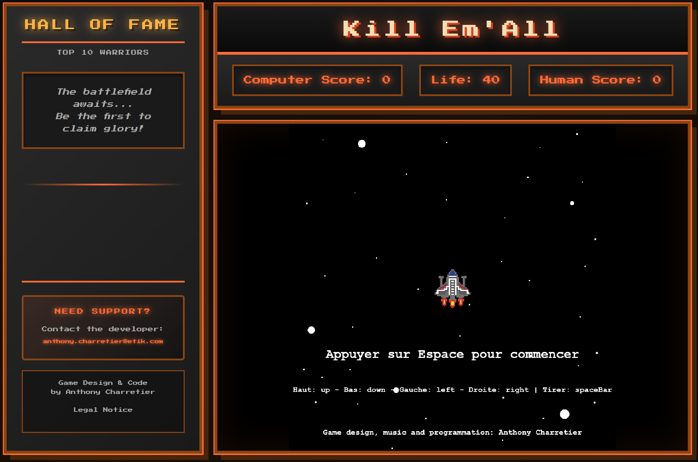

# Kill Em'All

Retro arcade shooter inspired by Atari 2600 aesthetics. Survive waves of enemies, rack up high scores, and dominate the leaderboard!

<div align="center">
  
  <p><i>Retro arcade shooter with leaderboard and score tracking</i></p>
</div>

## Play

**Controls:** Arrow keys (move) • Spacebar (shoot/start)

**Goal:** Reach 100 points before the computer or your health depletes!

## Quick Start

```bash
# 1. Clone & setup environment
cp .env.example .env
# Edit .env with your credentials

# 2. Setup database
mysql -u root -p < database.sql

# 3. Launch
php -S localhost:8080
```

## Configuration

Create `.env` file:

```env
DB_HOST=localhost
DB_NAME=killemall
DB_USER=root
DB_PASS=your_password

MAIL_TO=your-email@example.com
MAIL_FROM=noreply@yourdomain.com
MAIL_FROM_NAME=Kill Em'All Game
```

## Stack

HTML5 Canvas • Vanilla JS • PHP • MySQL • CSS Grid

## Database Setup

```sql
CREATE DATABASE killemall;
USE killemall;

CREATE TABLE game (
  id INT AUTO_INCREMENT PRIMARY KEY,
  name VARCHAR(100) NOT NULL,
  score INT NOT NULL,
  created_at TIMESTAMP DEFAULT CURRENT_TIMESTAMP
);
```

## Features

- Real-time score tracking vs AI opponent
- Top 10 global leaderboard
- Three enemy types (Aliens, Red Ships, Asteroids)
- Health system with collision damage
- Retro sound effects
- Email notifications for new scores

## Gameplay

- **Aliens** (1pt, -0.1 HP on hit)
- **Red Ships** (2pts, -0.05 HP on hit)
- **Asteroids** (0pts, -0.1 HP on hit)
- Start with 40 HP
- Win at 100 points or when computer reaches 100

## Author

**Anthony Charretier**
[anthony.charretier@etik.com](mailto:anthony.charretier@etik.com)

## License

MIT License - Free to use and modify
